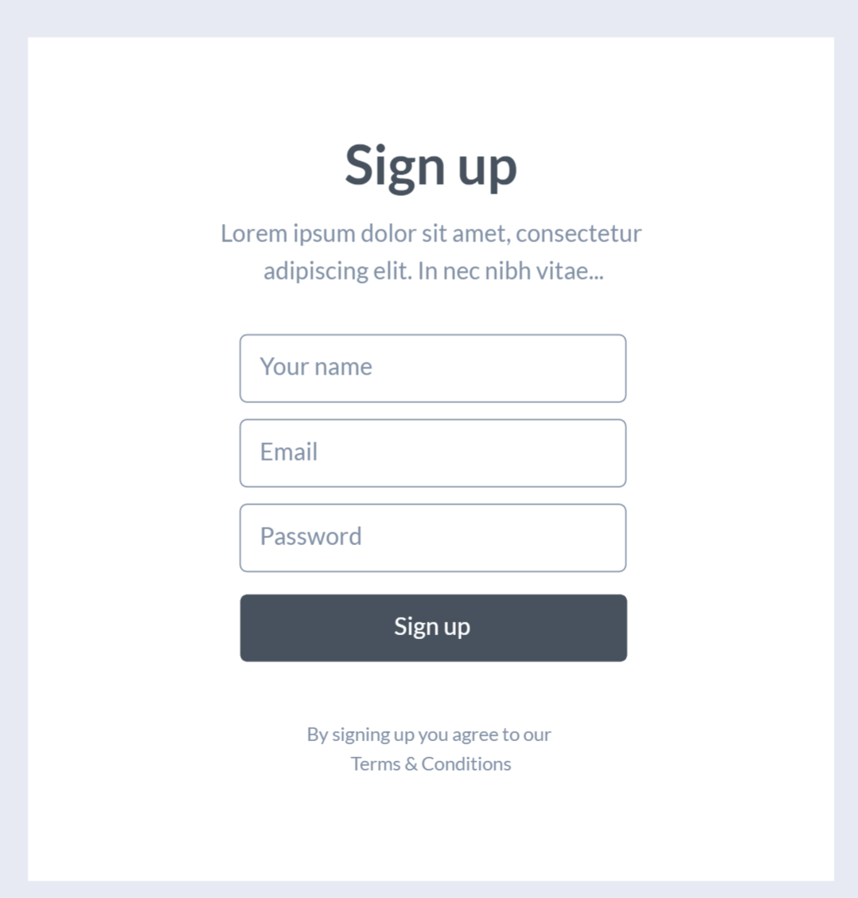
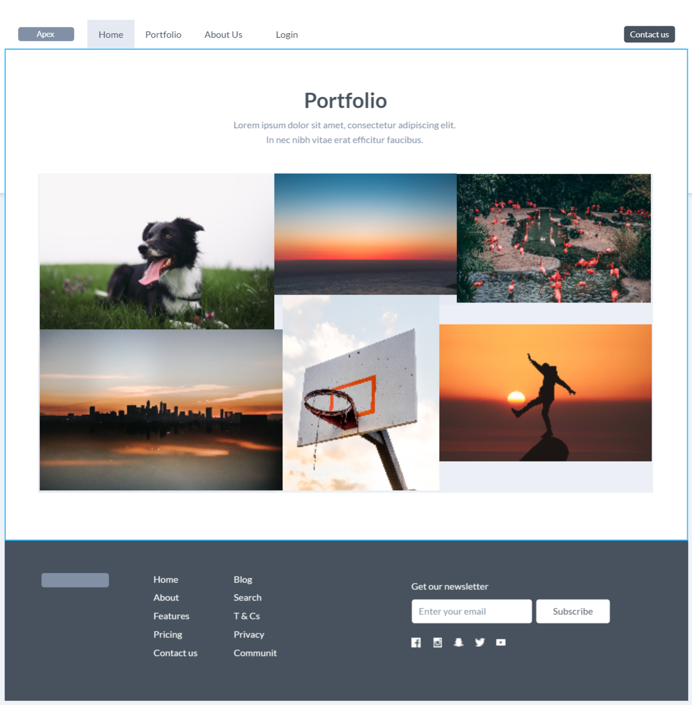

# Apex Shutterbug #

**For my website design and design and development, and for WEB-601  have provided a template that I would be using for the webiste.**

## Home ##

*This Framework in included with the menu bar, the pages of the websites that we will see in home page and others*

1. **1st Page on Home**

2. **2nd Page on Home**

3. **3rd Page on Home**

4. **4th Page on Home**

5. **5th Page on Home**

## Sign Up ##

*This Framework in included with the sign up page. It is provided with the page where the user will sign up or register if the user wants to download images*

## Portfolio ##
*This Framework in included with the images provided for the website, showing the puposes and the goal settings for the webiste. This portfolio will conatin the list of images that might be included for the webiste.However, it will be provided with subcategory that will determine the types of photography shot.*

