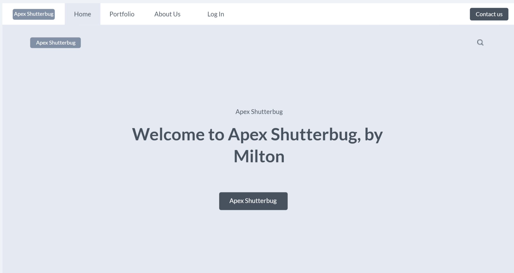
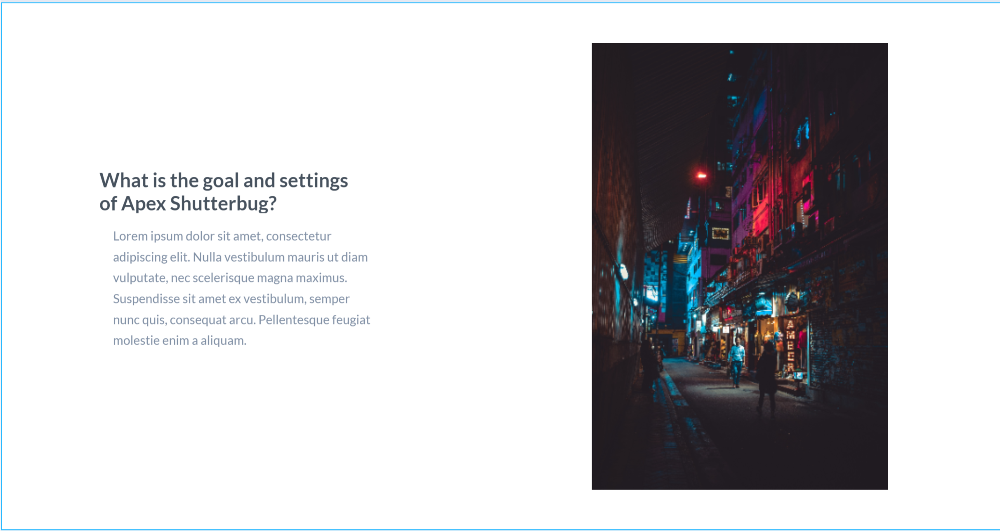
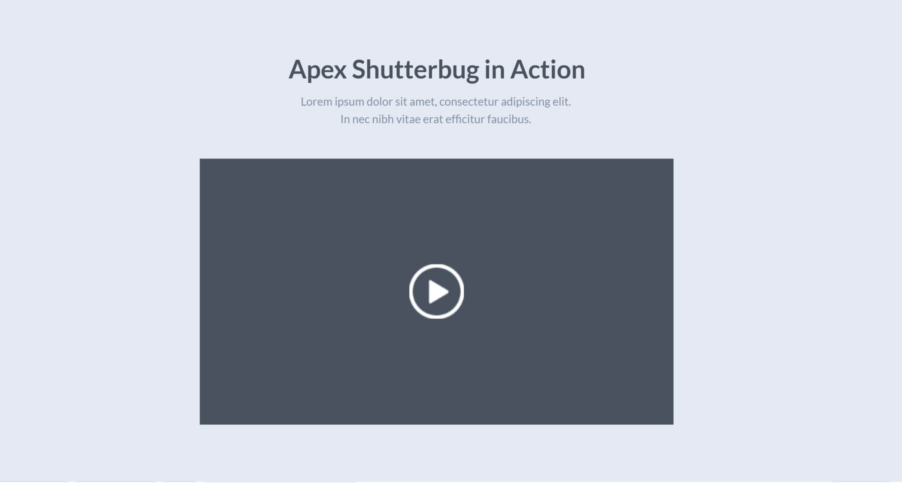
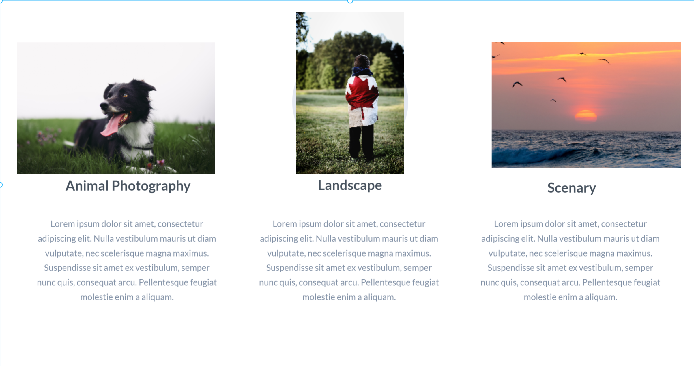
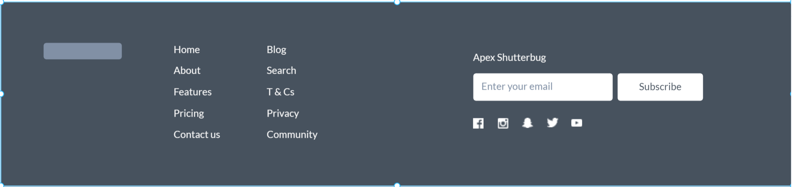

# Apex Shutterbug #

**For my website design and design and development, and for WEB-601  have provided a template that I would be using for the webiste.**

## Home ##

*This Framework in included with the menu bar, the pages of the websites that we will see in home page and others*

1. **1st Page on Home**

2. **2nd Page on Home**

3. **3rd Page on Home**

4. **4th Page on Home**

5. **5th Page on Home**

## Sign Up ##

